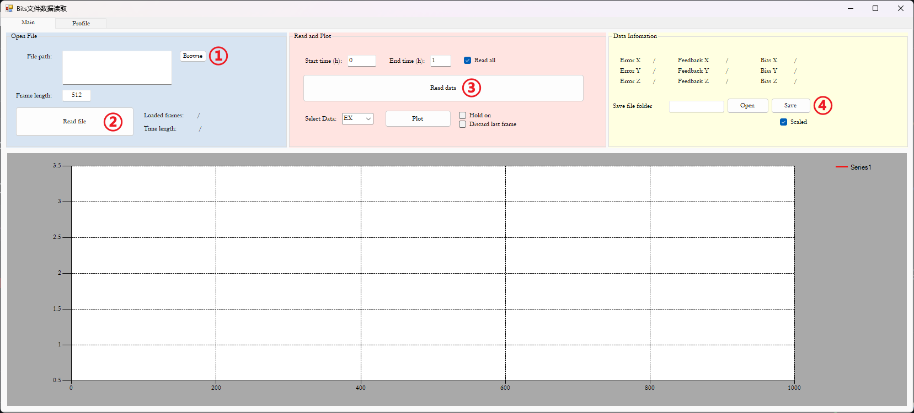

# MEMS_Bits_Read

使用步骤：

1. 浏览文件
2. 加载文件，等待【Loaded Frames】出现数字，即表示加载完成
3. 读取文件，选取【Read all】表示将读取所有数据，你也可以设置开始时间【Start time】和结束时间【End time】，需要保证这两个值不能超过总时长【Time Length】
4. 将反馈XYZ的数据转换为文本格式，并保存到当前文件夹，文件名与比特流文件名相同，后缀名为.txt

提醒：
- 复选框【Scaled】选中的话，数据会根据【Profile】中的标度转换为电压值；取消选中的话，保存的数据格式为24位有符号位整数值
- 复选框【Hold on】选中可以画多条数据
- 若要在MATLAB中读取转换后的文件，需要将窗口关闭
